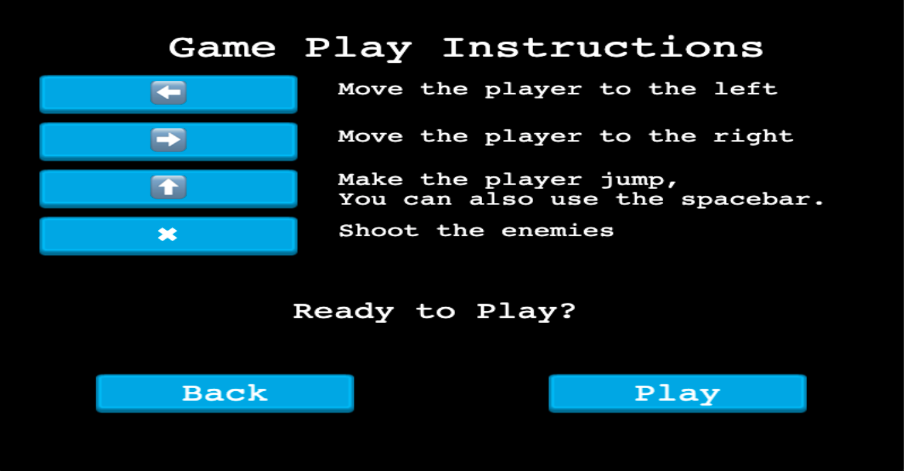

# JS-Shooter-game

<!--
*** Thanks for checking out this README Template. If you have a suggestion that would
*** make this better, please fork the repo and create a pull request or simply open
*** an issue with the tag "enhancement".
*** Thanks again! Now go create something AMAZING! :D
-->

<!-- PROJECT SHIELDS -->
<!--
*** I'm using markdown "reference style" links for readability.
*** Reference links are enclosed in brackets [ ] instead of parentheses ( ).
*** See the bottom of this document for the declaration of the reference variables
*** for contributors-url, forks-url, etc. This is an optional, concise syntax you may use.
*** https://www.markdownguide.org/basic-syntax/#reference-style-links
-->
[![Contributors][contributors-shield]][contributors-url]
[![Forks][forks-shield]][forks-url]
[![Stargazers][stars-shield]][stars-url]
[![Issues][issues-shield]][issues-url]

<!-- PROJECT LOGO -->
 

  

  <h3 align="center">Shooter Game</h3>

  

    This is my capstone assessment where I was tasked with building a shooter video game using Javascript and the game engine Phaser. 
     
    <a href="https://github.com/BrittanyBlake/JS-Shooter-game"><strong>Explore the docs »</strong></a>
     
     
    <a href="https://github.com/BrittanyBlake/JS-Shooter-game/issues">Report Bug</a>
    ·
    <a href="https://github.com/BrittanyBlake/JS-Shooter-game/issues">Request Feature</a>
  

<!-- TABLE OF CONTENTS -->
## Table of Contents

* [About the Project](#about-the-project)
  * [Built With](#built-with)
* [Contact](#Authors)
* [Acknowledgements](#acknowledgements)
* [How it works](#How-it-works)
* [Game Design](#Game-design)
* [Game Development](#Game-development)

<!-- ABOUT THE PROJECT -->
## About The Project

This is a 2D browser-based shooter game built with Phaser 3. The main character is a witch who gets attacked by a magic troll and his foxes trying to stop them from collectiong coins. For every coin collected, you will get 10 points and in the end you can see how you compare to other users. 

When the game loads, you will be taken to a screen with 4 options:
* Play => this takes you to the screen with the instructions. After reading the instructions you can choose to go back to the main menu or to start the game
* Options => from here, you can enable or disable the music/sound. 
* Credits => You can see the desgin details and contributions.
* Leaderboard => from here, you can see the users with the top scores and try to beat their scores 

<!-- HOW IT WORKS -->
## How It Works

You can use the following controls to play the game:
* ⬅️ - Press the left arrow key to move left.
* ➡️ - Press the right arrow key to move right
* ⬆️ - Press the up arrow key or the space bar to jump.
* X - Press the 'X' key to shoot the enemies.

<!-- Game Design -->
## Game Design
* I used [this](https://pipoya.itch.io/pipoya-free-2d-game-character-sprites
) sprite pack from Pipoya for the animations 
* I used [this](https://marwamj.itch.io/grass-plain-vector-2d-game-background
) pack from Marwam for the parallax background effect.
* I used [this](https://muhammadriza.itch.io/free-fantasy-rpg-music-pack?download) music pack from Muhammad Riza for the sound

## Witch
* Role: Main Character

    

* Witch's Attack:

    

## Enemy Troll

    

## Enemy Wolf

    

## Game Play

### Loading Screen:

    

### Menu Screen:

    

### Disable/Enable Audio:

    

### Credits:

    

### Leaderboard:

    

### Instructions:

    

### Game Play:

    

### Game Over:

    

## LIVE DEMO
 [Link to live demo](https://brittany-shooter-game.netlify.app/) 

<!-- BUILD WITH -->
## Built With
This project was built using these technologies.
* HTML
* CSS
* Javascript
* Phaser 3
* Webpack
* Leaderboard API service
* Eslint
* Stylelint
* Babel
* Jest
* ES6
* NPM

<!--GAME DEVELOPMENT-->
## Game Development

<!-- ABOUT THE PROJECT -->

## Getting Started
- To get a local copy up and running follow these simple steps.

#### Clone the repository to run the app.

- $ `git clone git@github.com:BrittanyBlake/JS-Shooter-game`
- `cd` into the project directory
- Run `npm install` to install the necessary modules
- Run `npm start` to automatically open the local server

<!-- CONTACT -->
## Authors

👤 **Brittany Blake**

- Github: [@BrittanyBlake](https://github.com/BrittanyBlake)
- Twitter: [@bbcodes_](https://twitter.com/bbcodes_)
- Linkedin: [Brittany Blake](https://www.linkedin.com/in/brittany-blake-843951109/)

<!-- ACKNOWLEDGEMENTS -->
## Acknowledgements
* [Microverse](https://www.microverse.org/)

## Show your support

Give a ⭐️ if you like this project!

<!-- MARKDOWN LINKS & IMAGES -->
<!-- https://www.markdownguide.org/basic-syntax/#reference-style-links -->
[contributors-shield]: https://img.shields.io/github/contributors/BrittanyBlake/JS-Shooter-game.svg?style=flat-square
[contributors-url]: https://github.com/BrittanyBlake/JS-Shooter-game/graphs/contributors
[forks-shield]: https://img.shields.io/github/forks/BrittanyBlake/JS-Shooter-game.svg?style=flat-square
[forks-url]: https://github.com/BrittanyBlake/JS-Shooter-game/network/members
[stars-shield]: https://img.shields.io/github/stars/BrittanyBlake/JS-Shooter-game?style=flat-square
[stars-url]: https://github.com/BrittanyBlake/JS-Shooter-game/stargazers
[issues-shield]: https://img.shields.io/github/issues/BrittanyBlake/JS-Shooter-game.svg?style=flat-square
[issues-url]: https://github.com/BrittanyBlake/JS-Shooter-game/issues

## 📝 License

This project is [MIT](https://opensource.org/licenses/MIT) licensed. 
